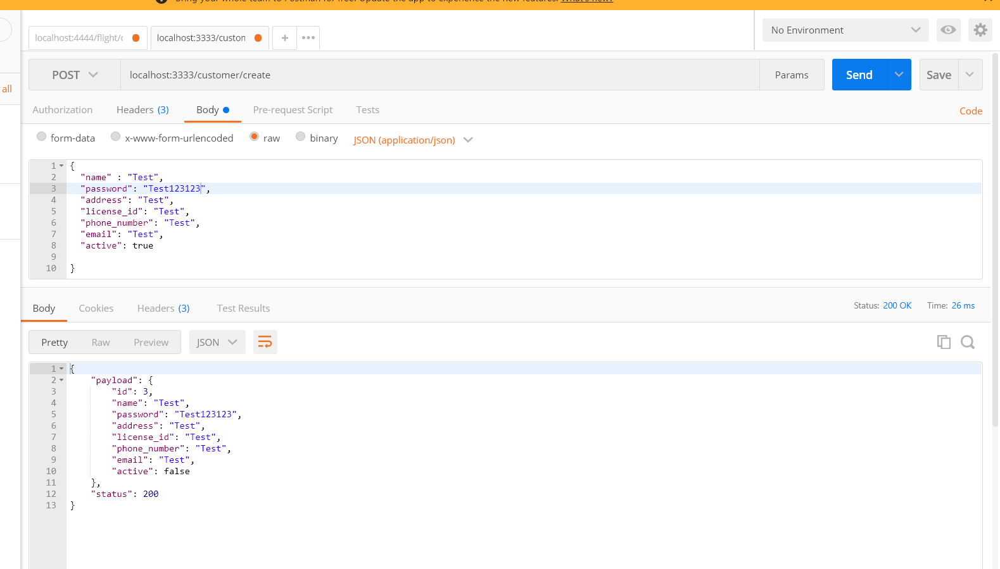

# ASSIGNMENT BOOKING, BASIC MICROSERVICE, GPRC

## Proto Gen

```shell
protoc -I=proto proto/*.proto --go_out=:pb --go-grpc_out=:pb
```

## Test with grpcui 
```
grpcui -plaintext 127.0.0.1:port
```

## API Customer

_
<br />
_
<br />
_
<br />

## API Flight
_
<br />
_
<br />
_
<br />


## API Booking
_
<br />
_
<br />
_
<br />

